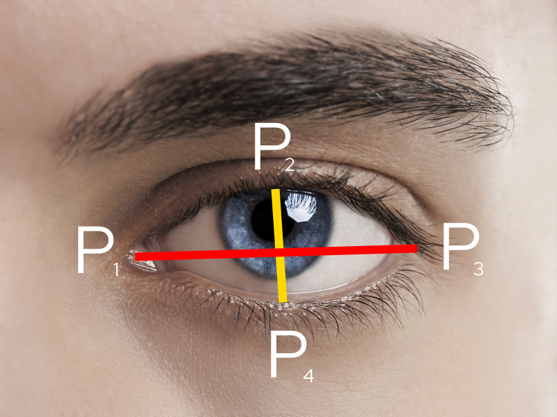

# Focus
#### By Autin Mitra, Andrew Lam, Andrew Xie, and David Liu

## What is Focus?
Focus is a web-based utility for preventing fatigue-based car accidents. 
It detects and alerts both drivers and vehicle systems to potential drowsiness - helping to prevent accidents.
This software is built to be easily ported to older vehicle independent of a "central compute unit" or a newer vehicle with one

## What technologies does it use?
We use GatsbyJS with theme-ui for our frontend visuals. We also combine [framer-motion](https://www.framer.com/motion/), for fancy animations

For face landmark detection, we use [@tfjs/face-landmark-detection](https://github.com/tensorflow/tfjs-models/tree/master/face-landmarks-detection).
We chose google's library over others since it has a relatively accurate, small, and therefore quick model, making it perfect for low-cost hardware.
We've also chose the WASM backend for tf.js considering that it performs better than WebGL on low-end devices, and about the same on medium-higher performance hardware.

## How does the drowsiness detection work?
We take the ratio of the height of one's eyes, compared to the length.
Because for most people, eyes are longer than the height, thee resulting ratio is 99% of the time a value from 0-1.

Here's a diagram and equation describing the calculation of the ratio, which is called **EAR**.

### Diagram

### Equation

Our ratio is similar to the one from here: [Real-Time Eye Blink Detection using Facial Landmarks](https://www.semanticscholar.org/paper/Real-Time-Eye-Blink-Detection-using-Facial-Soukupov%C3%A1-%C4%8Cech/4fa1ba3531219ca8c39d8749160faf1a877f2ced).
However, the main difference for ours is that we only use one vertical line for our aspect ratio. This is fine since the tf.js model is incredibly stable, and it *very slightly* improves perf (but it's probably not noticable at all).

You may worry that the drowsiness detection is extremely volative, but don't worry. From our testing, Google's face landmarks models are surprisingly extremely stable, even accurate
across a large range of head angles. 

## B-but this isn't state of the art machine learning 😢😢😢😢😢😢!!!!
This is a hackathon, we got 24 hours (some of which I'd like to use for sleep), and gathering training data, waiting for it to train, and then building the necessary infrastructure to make it run is a huge PITA. 

## What improvements could we make to this?
- Training a model to automatically predict the EAR threshold would be pretty nice. This probably wouldn't be too hard, but I'm sleepy.
- Gaze detection to make sure people are actually look at the road - apparently google's tf.js model for that is in development.
- Proper authentication/alternative methods to communicate with vehicles. Unsecured GET requests to shut down your car is a bit... sketchy.
  We could probably solve this problem with some rotating crypto style-stuff (kinda like U2F), and NOT communicating over web requests (we only did this for demo/concept purposes).

## Somehow you made it down here, and we hoped you enjoyed this project!
